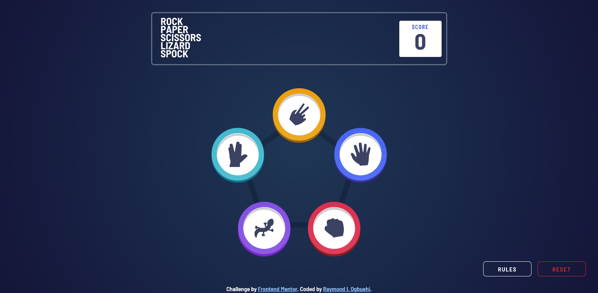

# Frontend Mentor - Rock, Paper, Scissors solution

This is a solution to the [Rock, Paper, Scissors challenge on Frontend Mentor](https://www.frontendmentor.io/challenges/rock-paper-scissors-game-pTgwgvgH). Frontend Mentor challenges help you improve your coding skills by building realistic projects. 

## Table of contents

- [Overview](#overview)
  - [The challenge](#the-challenge)
  - [Screenshot](#screenshot)
  - [Links](#links)
- [My process](#my-process)
  - [Built with](#built-with)
  - [What I learned](#what-i-learned)
  - [Continued development](#continued-development)
  - [Useful resources](#useful-resources)
- [Author](#author)

## Overview

### The challenge

Users should be able to:

- View the optimal layout for the game depending on their device's screen size
- Play Rock, Paper, Scissors against the computer
- Maintain the state of the score after refreshing the browser _(optional)_
- **Bonus**: Play Rock, Paper, Scissors, Lizard, Spock against the computer _(optional)_

### Screenshot

### Links

- Solution URL: [https://github.com/Ihezie/rock-paper-scissors-lizard-spock-game.git](https://github.com/Ihezie/rock-paper-scissors-lizard-spock-game.git)
- Live Site URL: [https://rock-paper-scissors-lizard-spock-app.netlify.app/](https://rock-paper-scissors-lizard-spock-app.netlify.app/)

## My process

### Built with

- Semantic HTML5 markup
- CSS custom properties
- Flexbox
- Mobile-first workflow
- [React](https://reactjs.org/) - JS library
- [tailwindCSS](https://tailwindcss.com/) - CSS library

### What I learned
During this project, I gained a firmer grasp of the `useReducer` hook. I was able to successfully implement it along with other react hooks to complete this project.

### Continued development
In the future, I plan to learn how to code cleaner and less buggy animations. Perhaps I will need to learn a library such as framer motion. Generally though, I hope to write better structured and more reusable code.

### Useful resources

- [https://codepen.io/ofthedead/pen/rVLgNy](https://codepen.io/ofthedead/pen/rVLgNy) - This code sample helped me create the circular wave animation that is triggered when the result component is rendered.

## Author

- Frontend Mentor - [@Ihezie](https://www.frontendmentor.io/profile/Ihezie)